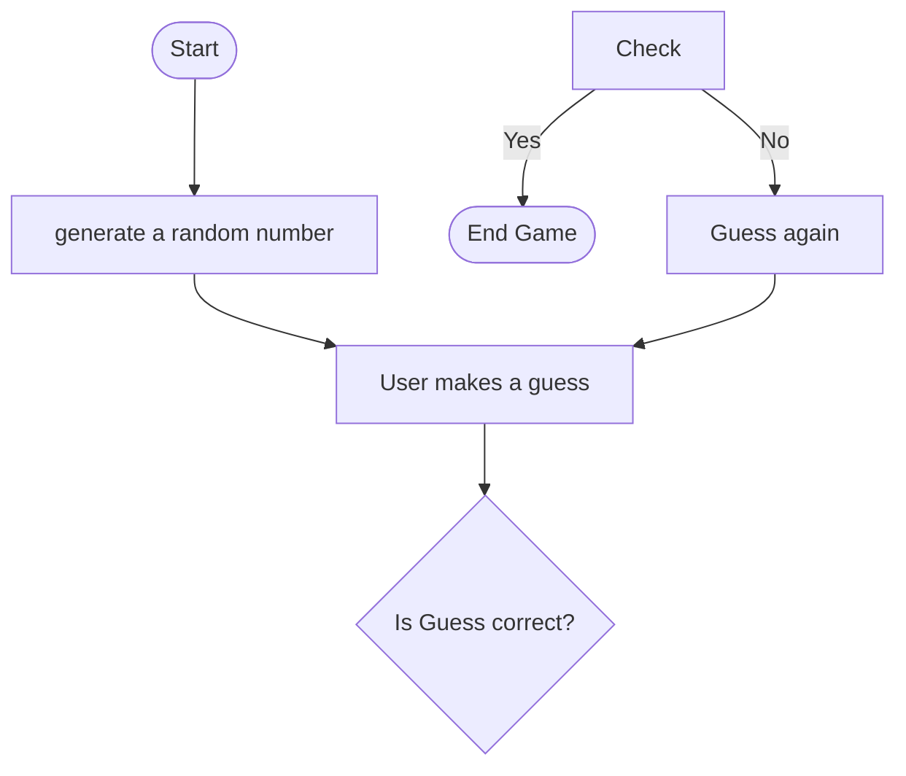

# Mermaid Flowchart for Assignment

## Flowchart explanation 

1. **Start**: The game begins.
2. **Generate a Random Number**: The system generates a random number, which the user needs to guess.
3. **User Makes a Guess**: The user is prompted to enter a guess.
4. **Check Guess**:
   - If the guess is correct, the game ends.
   - If the guess is incorrect, the user is prompted to make another guess.
5. **Loop Until Correct Guess**: If the guess is incorrect, the program goes back to the user making another guess until the user guesses the correct number.
6. **End Game**: The game ends when the user guesses the correct number.
